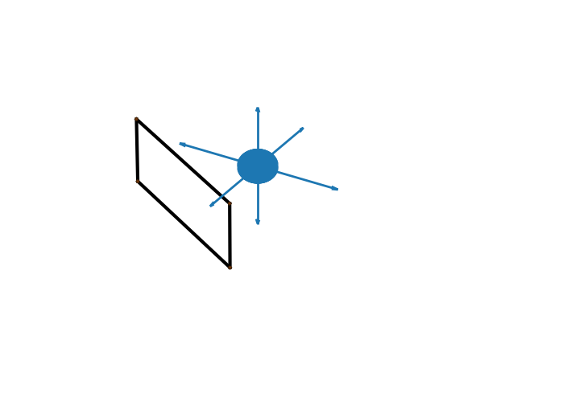

# 3D Primer: Simple 3D Development Tasks

## Cover Page
* Salutation!

## Contents 

* **Repo main directory consists of typical boilerplate files (e.g.README.md) and 3D development base modules/classes 
- aabb3 is module containing the bounded box AABB3 class 
* ** triangle_stuff
- Contains modules for creating triangle and tessellate structures . 
* ** plane_stuff
- Contains module for creating plane structures
* ** circle_stuff
- Contains module for creating circle structures 
* ** test_stuff 
- Contains simulations of 3d space tasks (i.e. rotating circle about axis)

## References
- "3D Math Primer for Graphics and Game Development" 

